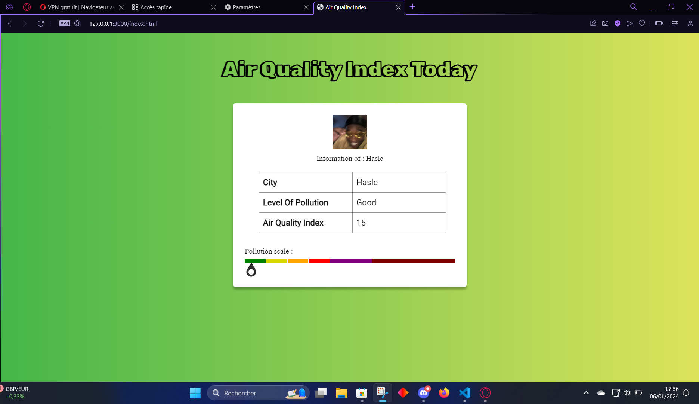
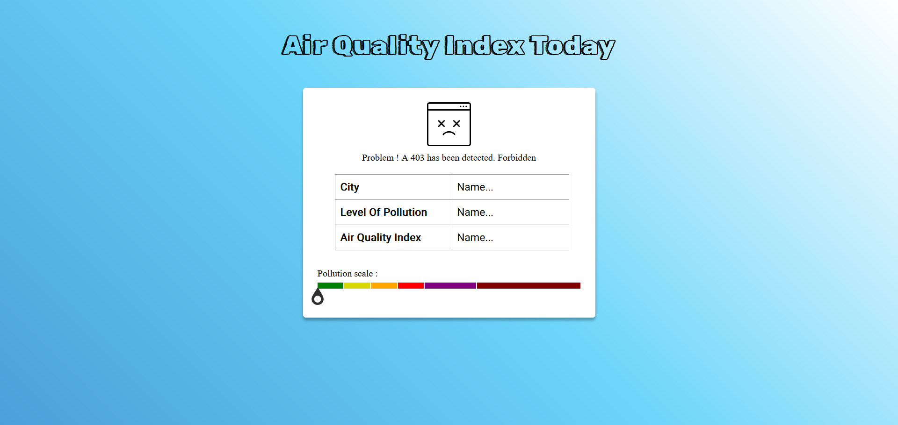

# Air Quality App
  

###### From the IQAir api we can see the city where you're IP Adress is from
###### The level of pollution : Good,Moderate,Unhealthy,Bad,Very Bad and Terrible.
###### The Air Quality Index

###### Here we can see the case when we have an error, I deliberately removed part of the API key to cause this 403 error for example

